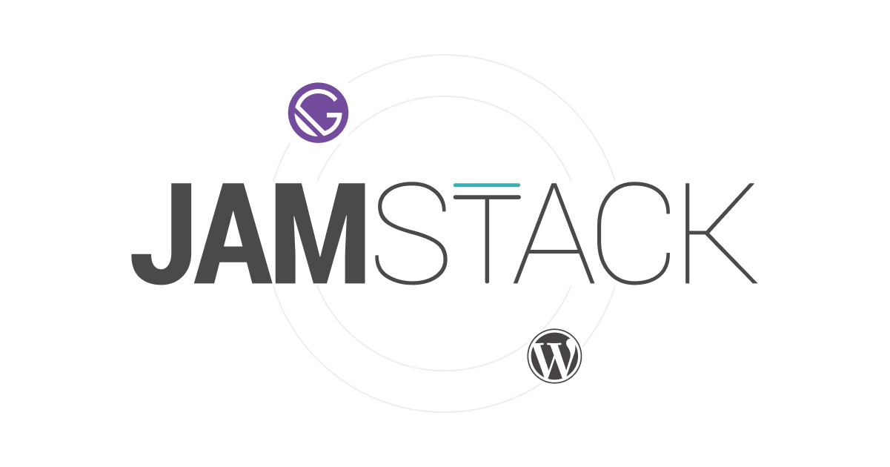

# Jamstack WordPress

Gatsby と WordPress を使用した簡易的なブログサイトです。WordPress を Headless CMS（記事の管理のみ）としてあつかい、React のフレームワークである Gatsby を利用してデータを取得しています。

> Collaboration between Gatsby and WordPress.

Demo: https://jamstack-wp.netlify.app/

## Technology 🚀

[Gatsby](https://www.gatsbyjs.com/) - A React-based open source framework

[WordPress](https://wordpress.org/) - A Blog Tool, Publishing Platform, and CMS

[Netlify](https://www.netlify.com/) - A Hosting service

## Photos 📷

- [@jeztimms](https://unsplash.com/photos/WnyIQGh9ciM)

- [@gabrielj_photography](https://unsplash.com/photos/jin4W1HqgL4)

- [@joshmillgate](https://unsplash.com/photos/tQS1_2HTuaQ)

## Special Thanks 🙌

- [gatsby-source-wordpress@v4 BETA](https://github.com/gatsbyjs/gatsby-source-wordpress-experimental)

- [WPGatsby](https://ja.wordpress.org/plugins/wp-gatsby/)

- [WPGraphQL](https://ja.wordpress.org/plugins/wp-graphql/)